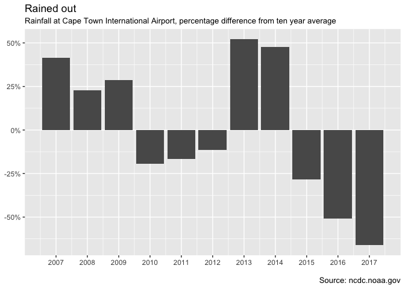

The following code is used to extract and clean rainfall data from Cape
Town International Airport.

The data is available from:

Loading the dependencies
========================

    library(readr)
    library(tidyverse)
    library(lubridate)
    library(stringr)
    library(forcats)
    library(knitr)

I use knitr::kable for the rendering of the markdown tables. This makes
it easier to read in many formats, notably Github.

Loading the data
================

Before begining, it is helpful to start with the uncompressed data files
in a single file location. In my case I have placed them in a folder
called 'Data' which is located in the working directory.

This will make it simple to get everything into a dataframe (or tibble)
quickly.

Using the 'list.files' and 'as\_tibble' functions, I am able to get a
dataframe with a single column of the file names.

    file_names<-list.files("Data/") %>% 
      as_tibble() %>% 
      rename(file_name="value") 

    file_names %>% 
      kable()

<table>
<thead>
<tr class="header">
<th align="left">file_name</th>
</tr>
</thead>
<tbody>
<tr class="odd">
<td align="left">688160-99999-2007.op</td>
</tr>
<tr class="even">
<td align="left">688160-99999-2008.op</td>
</tr>
<tr class="odd">
<td align="left">688160-99999-2009.op</td>
</tr>
<tr class="even">
<td align="left">688160-99999-2010.op</td>
</tr>
<tr class="odd">
<td align="left">688160-99999-2011.op</td>
</tr>
<tr class="even">
<td align="left">688160-99999-2012.op</td>
</tr>
<tr class="odd">
<td align="left">688160-99999-2013.op</td>
</tr>
<tr class="even">
<td align="left">688160-99999-2014.op</td>
</tr>
<tr class="odd">
<td align="left">688160-99999-2015.op</td>
</tr>
<tr class="even">
<td align="left">688160-99999-2016.op</td>
</tr>
<tr class="odd">
<td align="left">688160-99999-2017.op</td>
</tr>
</tbody>
</table>

It is easier to work with file locations than with file names, I add a
column to the dataframe with the suffix of the file location. In this
case it is "Data/".

From there, I use purrr's map function to invoke the 'read\_table'
function, which extracts each file as a tibble, which are then stored in
a list column in the dataframe.

The 'unnest' function can then be used to lump the tables together in
the single dataframe.

From that point we don't need the file\_name or file\_location fields.

    data<-file_names %>% 
      mutate(file_location=str_c("Data/",file_name,sep="")) %>% 
      mutate(data_table=map(file_location,read_table)) %>% 
      unnest(data_table) %>% 
      select(-file_name,-file_location)

    data %>% 
      head(10) %>% 
      kable()

<table>
<thead>
<tr class="header">
<th align="right">STN---</th>
<th align="right">WBAN</th>
<th align="right">YEARMODA</th>
<th align="right">TEMP</th>
<th align="right">X5</th>
<th align="right">DEWP</th>
<th align="right">X7</th>
<th align="right">SLP</th>
<th align="right">X9</th>
<th align="right">STP</th>
<th align="right">X11</th>
<th align="right">VISIB</th>
<th align="right">X13</th>
<th align="right">WDSP</th>
<th align="right">X15</th>
<th align="right">MXSPD</th>
<th align="right">GUST</th>
<th align="left">MAX</th>
<th align="left">MIN</th>
<th align="left">PRCP</th>
<th align="right">SNDP</th>
<th align="left">FRSHTT</th>
</tr>
</thead>
<tbody>
<tr class="odd">
<td align="right">688160</td>
<td align="right">99999</td>
<td align="right">20070101</td>
<td align="right">66.8</td>
<td align="right">24</td>
<td align="right">47.5</td>
<td align="right">24</td>
<td align="right">1020.4</td>
<td align="right">7</td>
<td align="right">1015.4</td>
<td align="right">7</td>
<td align="right">11.7</td>
<td align="right">24</td>
<td align="right">8.9</td>
<td align="right">24</td>
<td align="right">14.0</td>
<td align="right">999.9</td>
<td align="left">79.5</td>
<td align="left">49.6</td>
<td align="left">0.00I</td>
<td align="right">999.9</td>
<td align="left">000000</td>
</tr>
<tr class="even">
<td align="right">688160</td>
<td align="right">99999</td>
<td align="right">20070102</td>
<td align="right">71.6</td>
<td align="right">24</td>
<td align="right">56.8</td>
<td align="right">24</td>
<td align="right">1015.8</td>
<td align="right">8</td>
<td align="right">1010.8</td>
<td align="right">8</td>
<td align="right">11.3</td>
<td align="right">24</td>
<td align="right">11.5</td>
<td align="right">24</td>
<td align="right">16.9</td>
<td align="right">999.9</td>
<td align="left">84.6</td>
<td align="left">55.8</td>
<td align="left">0.00I</td>
<td align="right">999.9</td>
<td align="left">000000</td>
</tr>
<tr class="odd">
<td align="right">688160</td>
<td align="right">99999</td>
<td align="right">20070103</td>
<td align="right">70.4</td>
<td align="right">23</td>
<td align="right">61.8</td>
<td align="right">23</td>
<td align="right">1016.3</td>
<td align="right">8</td>
<td align="right">1011.4</td>
<td align="right">8</td>
<td align="right">9.9</td>
<td align="right">23</td>
<td align="right">16.3</td>
<td align="right">23</td>
<td align="right">22.9</td>
<td align="right">999.9</td>
<td align="left">84.6</td>
<td align="left">64.6</td>
<td align="left">0.00I</td>
<td align="right">999.9</td>
<td align="left">000000</td>
</tr>
<tr class="even">
<td align="right">688160</td>
<td align="right">99999</td>
<td align="right">20070104</td>
<td align="right">71.7</td>
<td align="right">24</td>
<td align="right">61.6</td>
<td align="right">24</td>
<td align="right">1014.9</td>
<td align="right">8</td>
<td align="right">1010.0</td>
<td align="right">8</td>
<td align="right">12.8</td>
<td align="right">24</td>
<td align="right">11.2</td>
<td align="right">24</td>
<td align="right">18.1</td>
<td align="right">999.9</td>
<td align="left">82.0</td>
<td align="left">64.4*</td>
<td align="left">0.00I</td>
<td align="right">999.9</td>
<td align="left">000000</td>
</tr>
<tr class="odd">
<td align="right">688160</td>
<td align="right">99999</td>
<td align="right">20070105</td>
<td align="right">69.2</td>
<td align="right">24</td>
<td align="right">58.8</td>
<td align="right">24</td>
<td align="right">1013.9</td>
<td align="right">8</td>
<td align="right">1009.0</td>
<td align="right">8</td>
<td align="right">10.6</td>
<td align="right">24</td>
<td align="right">9.6</td>
<td align="right">24</td>
<td align="right">13.0</td>
<td align="right">999.9</td>
<td align="left">82.0</td>
<td align="left">62.6*</td>
<td align="left">0.00I</td>
<td align="right">999.9</td>
<td align="left">000000</td>
</tr>
<tr class="even">
<td align="right">688160</td>
<td align="right">99999</td>
<td align="right">20070106</td>
<td align="right">65.8</td>
<td align="right">24</td>
<td align="right">55.7</td>
<td align="right">24</td>
<td align="right">1017.0</td>
<td align="right">7</td>
<td align="right">1012.0</td>
<td align="right">7</td>
<td align="right">10.7</td>
<td align="right">24</td>
<td align="right">9.6</td>
<td align="right">24</td>
<td align="right">15.9</td>
<td align="right">999.9</td>
<td align="left">77.5</td>
<td align="left">56.5</td>
<td align="left">0.00E</td>
<td align="right">999.9</td>
<td align="left">010000</td>
</tr>
<tr class="odd">
<td align="right">688160</td>
<td align="right">99999</td>
<td align="right">20070107</td>
<td align="right">64.9</td>
<td align="right">24</td>
<td align="right">46.8</td>
<td align="right">24</td>
<td align="right">1021.9</td>
<td align="right">8</td>
<td align="right">1016.9</td>
<td align="right">8</td>
<td align="right">12.2</td>
<td align="right">24</td>
<td align="right">12.8</td>
<td align="right">24</td>
<td align="right">19.0</td>
<td align="right">999.9</td>
<td align="left">75.2</td>
<td align="left">60.6</td>
<td align="left">0.00G</td>
<td align="right">999.9</td>
<td align="left">000000</td>
</tr>
<tr class="even">
<td align="right">688160</td>
<td align="right">99999</td>
<td align="right">20070108</td>
<td align="right">68.4</td>
<td align="right">24</td>
<td align="right">56.9</td>
<td align="right">24</td>
<td align="right">1019.5</td>
<td align="right">8</td>
<td align="right">1014.5</td>
<td align="right">8</td>
<td align="right">12.6</td>
<td align="right">24</td>
<td align="right">9.6</td>
<td align="right">24</td>
<td align="right">15.0</td>
<td align="right">999.9</td>
<td align="left">77.0</td>
<td align="left">60.3</td>
<td align="left">0.00I</td>
<td align="right">999.9</td>
<td align="left">000000</td>
</tr>
<tr class="odd">
<td align="right">688160</td>
<td align="right">99999</td>
<td align="right">20070109</td>
<td align="right">69.3</td>
<td align="right">24</td>
<td align="right">60.9</td>
<td align="right">24</td>
<td align="right">1015.7</td>
<td align="right">8</td>
<td align="right">1010.8</td>
<td align="right">8</td>
<td align="right">12.0</td>
<td align="right">24</td>
<td align="right">17.7</td>
<td align="right">24</td>
<td align="right">22.9</td>
<td align="right">34.0</td>
<td align="left">77.2</td>
<td align="left">64.4*</td>
<td align="left">0.00I</td>
<td align="right">999.9</td>
<td align="left">000000</td>
</tr>
<tr class="even">
<td align="right">688160</td>
<td align="right">99999</td>
<td align="right">20070110</td>
<td align="right">74.6</td>
<td align="right">24</td>
<td align="right">63.3</td>
<td align="right">24</td>
<td align="right">1010.6</td>
<td align="right">7</td>
<td align="right">1005.7</td>
<td align="right">7</td>
<td align="right">11.0</td>
<td align="right">24</td>
<td align="right">12.3</td>
<td align="right">24</td>
<td align="right">15.9</td>
<td align="right">999.9</td>
<td align="left">88.3</td>
<td align="left">66.2</td>
<td align="left">0.00I</td>
<td align="right">999.9</td>
<td align="left">000000</td>
</tr>
</tbody>
</table>

Cleaning the data
=================

A number of things need to be done in order to clean the data.

Only a few of the columns are needed for the analysis.

A number of the columns are renamed to something more meaningful.

From there, the precipitation needs to be parsed from the data stroage
format. That means removing the type of precipitation to make the value
numeric. This is done by removing the letters A through to I. 99.99 is
used as a zero value, so that is replaced as appropriate.

    clean_data<-data %>% 
      select(`STN---`,YEARMODA,TEMP,PRCP) %>% 
      rename(Station=`STN---`) %>% 
      mutate(Date=ymd(YEARMODA)) %>% 
      select(-YEARMODA) %>% 
      mutate(PRCP=str_replace(PRCP,"[ABCDEFGHI]","")) %>% 
      mutate(PRCP=as.numeric(str_replace(PRCP,"99.99","0"))) %>% 
      arrange(desc(PRCP)) %>% 
      arrange(desc(Date))

    clean_data

    ## # A tibble: 4,014 x 4
    ##    Station  TEMP  PRCP Date      
    ##      <int> <dbl> <dbl> <date>    
    ##  1  688160  66.8     0 2017-12-31
    ##  2  688160  71.3     0 2017-12-30
    ##  3  688160  71.8     0 2017-12-29
    ##  4  688160  70.8     0 2017-12-28
    ##  5  688160  66.9     0 2017-12-27
    ##  6  688160  67.1     0 2017-12-26
    ##  7  688160  64.4     0 2017-12-25
    ##  8  688160  66.4     0 2017-12-24
    ##  9  688160  67.4     0 2017-12-23
    ## 10  688160  67.5     0 2017-12-22
    ## # ... with 4,004 more rows

Summarising the data
====================

    summary_data<-clean_data %>% 
      mutate(Year=year(Date),Month=quarter(Date)) %>% 
      group_by(Year,Station) %>% 
      summarise(PRCP=sum(PRCP),Date=min(Date)) %>% 
      ungroup() %>%
      mutate(avr_prcp=mean(PRCP)) %>% 
      mutate(diff_mean_prcp=PRCP-avr_prcp) %>% 
      mutate(diff_mean_prcp_pct=diff_mean_prcp/avr_prcp)

    summary_data

    ## # A tibble: 11 x 7
    ##     Year Station  PRCP Date       avr_prcp diff_mean_prcp diff_mean_prcp_~
    ##    <dbl>   <int> <dbl> <date>        <dbl>          <dbl>            <dbl>
    ##  1  2007  688160 24.9  2007-01-01     17.6           7.32            0.416
    ##  2  2008  688160 21.6  2008-01-01     17.6           4.00            0.227
    ##  3  2009  688160 22.6  2009-01-01     17.6           5.02            0.285
    ##  4  2010  688160 14.2  2010-01-01     17.6         - 3.39           -0.192
    ##  5  2011  688160 14.7  2011-01-01     17.6         - 2.92           -0.166
    ##  6  2012  688160 15.6  2012-01-01     17.6         - 2.01           -0.114
    ##  7  2013  688160 26.8  2013-01-01     17.6           9.17            0.521
    ##  8  2014  688160 26.0  2014-01-01     17.6           8.38            0.476
    ##  9  2015  688160 12.6  2015-01-01     17.6         - 4.98           -0.283
    ## 10  2016  688160  8.64 2016-01-01     17.6         - 8.98           -0.510
    ## 11  2017  688160  5.98 2017-01-02     17.6         -11.6            -0.661

Plotting
========

    summary_data %>% 
      ggplot(aes(y=diff_mean_prcp_pct,x=Date)) +
      geom_col() +
      scale_x_date(date_breaks = "1 year",date_labels = "%Y") +
      scale_y_continuous(labels = scales::percent) +
      labs(title="Rained out") +
      labs(subtitle="Rainfall at Cape Town International Airport, percentage difference from ten year average") +
      labs(caption="\nSource: ncdc.noaa.gov") +
      theme(axis.title = element_blank()) 

