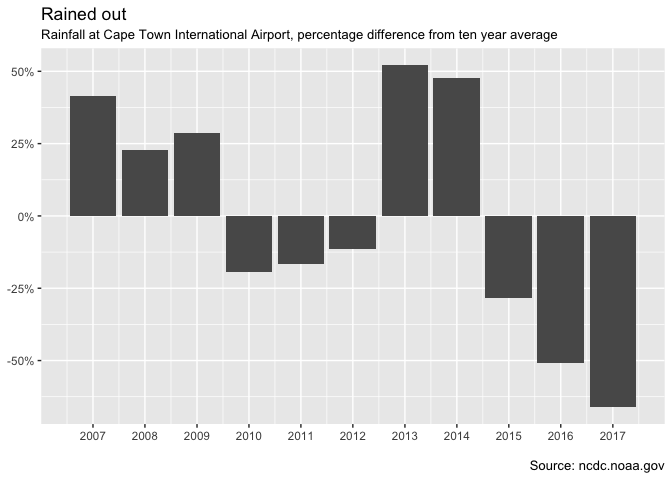

Cape Town Rainfall Data Analysis
================================

The following code is used to extract, clean and analyse rainfall data
from Cape Town International Airport.

The data is available from: <ftp://ftp.ncdc.noaa.gov/pub/data/gsod/>

The data is initially grouped by date and then by station number. Cape
Town's station number is 688160.

Loading the dependencies
------------------------

    library(readr)
    library(tidyverse)
    library(lubridate)
    library(stringr)
    library(forcats)
    library(knitr)

I use knitr::kable for the rendering of the markdown tables. This makes
it easier to read in many formats, notably Github.

Loading the data
----------------

Before begining, it is helpful to start with the uncompressed data files
in a single file location. In my case I have placed them in a folder
called 'Data' which is located in the working directory.

This will make it simple to get everything into a dataframe (or tibble)
quickly.

Using the list.files() and as\_tibble() functions, I am able to get a
dataframe with a single column of the file names.

    file_names<-list.files("Data/") %>% 
      as_tibble() %>% 
      rename(file_name="value") 

    file_names %>% 
      kable()

<table>
<thead>
<tr class="header">
<th align="left">file_name</th>
</tr>
</thead>
<tbody>
<tr class="odd">
<td align="left">688160-99999-2007.op</td>
</tr>
<tr class="even">
<td align="left">688160-99999-2008.op</td>
</tr>
<tr class="odd">
<td align="left">688160-99999-2009.op</td>
</tr>
<tr class="even">
<td align="left">688160-99999-2010.op</td>
</tr>
<tr class="odd">
<td align="left">688160-99999-2011.op</td>
</tr>
<tr class="even">
<td align="left">688160-99999-2012.op</td>
</tr>
<tr class="odd">
<td align="left">688160-99999-2013.op</td>
</tr>
<tr class="even">
<td align="left">688160-99999-2014.op</td>
</tr>
<tr class="odd">
<td align="left">688160-99999-2015.op</td>
</tr>
<tr class="even">
<td align="left">688160-99999-2016.op</td>
</tr>
<tr class="odd">
<td align="left">688160-99999-2017.op</td>
</tr>
</tbody>
</table>

As you will be able to see, I have only downloaded the last 10 full
years of data. The procedure is exactly the same if you choose a greater
or fewer number of years.

It is easier to work with file locations than with file names, I add a
column to the dataframe with the suffix of the file location. In this
case it is "Data/".

From there, I use purrr's map function to invoke the read\_table()
function, which extracts each file as a tibble, which are then stored in
a list column in the dataframe.

The unnest() function can then be used to lump the tables together in
the single dataframe.

From that point we don't need the file\_name or file\_location fields.

    data<-file_names %>% 
      mutate(file_location=str_c("Data/",file_name,sep="")) %>% 
      mutate(data_table=map(file_location,read_table)) %>% 
      unnest(data_table) %>% 
      select(-file_name,-file_location)

    data %>% 
      head(10) %>% 
      kable()

<table>
<thead>
<tr class="header">
<th align="right">STN---</th>
<th align="right">WBAN</th>
<th align="right">YEARMODA</th>
<th align="right">TEMP</th>
<th align="right">X5</th>
<th align="right">DEWP</th>
<th align="right">X7</th>
<th align="right">SLP</th>
<th align="right">X9</th>
<th align="right">STP</th>
<th align="right">X11</th>
<th align="right">VISIB</th>
<th align="right">X13</th>
<th align="right">WDSP</th>
<th align="right">X15</th>
<th align="right">MXSPD</th>
<th align="right">GUST</th>
<th align="left">MAX</th>
<th align="left">MIN</th>
<th align="left">PRCP</th>
<th align="right">SNDP</th>
<th align="left">FRSHTT</th>
</tr>
</thead>
<tbody>
<tr class="odd">
<td align="right">688160</td>
<td align="right">99999</td>
<td align="right">20070101</td>
<td align="right">66.8</td>
<td align="right">24</td>
<td align="right">47.5</td>
<td align="right">24</td>
<td align="right">1020.4</td>
<td align="right">7</td>
<td align="right">1015.4</td>
<td align="right">7</td>
<td align="right">11.7</td>
<td align="right">24</td>
<td align="right">8.9</td>
<td align="right">24</td>
<td align="right">14.0</td>
<td align="right">999.9</td>
<td align="left">79.5</td>
<td align="left">49.6</td>
<td align="left">0.00I</td>
<td align="right">999.9</td>
<td align="left">000000</td>
</tr>
<tr class="even">
<td align="right">688160</td>
<td align="right">99999</td>
<td align="right">20070102</td>
<td align="right">71.6</td>
<td align="right">24</td>
<td align="right">56.8</td>
<td align="right">24</td>
<td align="right">1015.8</td>
<td align="right">8</td>
<td align="right">1010.8</td>
<td align="right">8</td>
<td align="right">11.3</td>
<td align="right">24</td>
<td align="right">11.5</td>
<td align="right">24</td>
<td align="right">16.9</td>
<td align="right">999.9</td>
<td align="left">84.6</td>
<td align="left">55.8</td>
<td align="left">0.00I</td>
<td align="right">999.9</td>
<td align="left">000000</td>
</tr>
<tr class="odd">
<td align="right">688160</td>
<td align="right">99999</td>
<td align="right">20070103</td>
<td align="right">70.4</td>
<td align="right">23</td>
<td align="right">61.8</td>
<td align="right">23</td>
<td align="right">1016.3</td>
<td align="right">8</td>
<td align="right">1011.4</td>
<td align="right">8</td>
<td align="right">9.9</td>
<td align="right">23</td>
<td align="right">16.3</td>
<td align="right">23</td>
<td align="right">22.9</td>
<td align="right">999.9</td>
<td align="left">84.6</td>
<td align="left">64.6</td>
<td align="left">0.00I</td>
<td align="right">999.9</td>
<td align="left">000000</td>
</tr>
<tr class="even">
<td align="right">688160</td>
<td align="right">99999</td>
<td align="right">20070104</td>
<td align="right">71.7</td>
<td align="right">24</td>
<td align="right">61.6</td>
<td align="right">24</td>
<td align="right">1014.9</td>
<td align="right">8</td>
<td align="right">1010.0</td>
<td align="right">8</td>
<td align="right">12.8</td>
<td align="right">24</td>
<td align="right">11.2</td>
<td align="right">24</td>
<td align="right">18.1</td>
<td align="right">999.9</td>
<td align="left">82.0</td>
<td align="left">64.4*</td>
<td align="left">0.00I</td>
<td align="right">999.9</td>
<td align="left">000000</td>
</tr>
<tr class="odd">
<td align="right">688160</td>
<td align="right">99999</td>
<td align="right">20070105</td>
<td align="right">69.2</td>
<td align="right">24</td>
<td align="right">58.8</td>
<td align="right">24</td>
<td align="right">1013.9</td>
<td align="right">8</td>
<td align="right">1009.0</td>
<td align="right">8</td>
<td align="right">10.6</td>
<td align="right">24</td>
<td align="right">9.6</td>
<td align="right">24</td>
<td align="right">13.0</td>
<td align="right">999.9</td>
<td align="left">82.0</td>
<td align="left">62.6*</td>
<td align="left">0.00I</td>
<td align="right">999.9</td>
<td align="left">000000</td>
</tr>
<tr class="even">
<td align="right">688160</td>
<td align="right">99999</td>
<td align="right">20070106</td>
<td align="right">65.8</td>
<td align="right">24</td>
<td align="right">55.7</td>
<td align="right">24</td>
<td align="right">1017.0</td>
<td align="right">7</td>
<td align="right">1012.0</td>
<td align="right">7</td>
<td align="right">10.7</td>
<td align="right">24</td>
<td align="right">9.6</td>
<td align="right">24</td>
<td align="right">15.9</td>
<td align="right">999.9</td>
<td align="left">77.5</td>
<td align="left">56.5</td>
<td align="left">0.00E</td>
<td align="right">999.9</td>
<td align="left">010000</td>
</tr>
<tr class="odd">
<td align="right">688160</td>
<td align="right">99999</td>
<td align="right">20070107</td>
<td align="right">64.9</td>
<td align="right">24</td>
<td align="right">46.8</td>
<td align="right">24</td>
<td align="right">1021.9</td>
<td align="right">8</td>
<td align="right">1016.9</td>
<td align="right">8</td>
<td align="right">12.2</td>
<td align="right">24</td>
<td align="right">12.8</td>
<td align="right">24</td>
<td align="right">19.0</td>
<td align="right">999.9</td>
<td align="left">75.2</td>
<td align="left">60.6</td>
<td align="left">0.00G</td>
<td align="right">999.9</td>
<td align="left">000000</td>
</tr>
<tr class="even">
<td align="right">688160</td>
<td align="right">99999</td>
<td align="right">20070108</td>
<td align="right">68.4</td>
<td align="right">24</td>
<td align="right">56.9</td>
<td align="right">24</td>
<td align="right">1019.5</td>
<td align="right">8</td>
<td align="right">1014.5</td>
<td align="right">8</td>
<td align="right">12.6</td>
<td align="right">24</td>
<td align="right">9.6</td>
<td align="right">24</td>
<td align="right">15.0</td>
<td align="right">999.9</td>
<td align="left">77.0</td>
<td align="left">60.3</td>
<td align="left">0.00I</td>
<td align="right">999.9</td>
<td align="left">000000</td>
</tr>
<tr class="odd">
<td align="right">688160</td>
<td align="right">99999</td>
<td align="right">20070109</td>
<td align="right">69.3</td>
<td align="right">24</td>
<td align="right">60.9</td>
<td align="right">24</td>
<td align="right">1015.7</td>
<td align="right">8</td>
<td align="right">1010.8</td>
<td align="right">8</td>
<td align="right">12.0</td>
<td align="right">24</td>
<td align="right">17.7</td>
<td align="right">24</td>
<td align="right">22.9</td>
<td align="right">34.0</td>
<td align="left">77.2</td>
<td align="left">64.4*</td>
<td align="left">0.00I</td>
<td align="right">999.9</td>
<td align="left">000000</td>
</tr>
<tr class="even">
<td align="right">688160</td>
<td align="right">99999</td>
<td align="right">20070110</td>
<td align="right">74.6</td>
<td align="right">24</td>
<td align="right">63.3</td>
<td align="right">24</td>
<td align="right">1010.6</td>
<td align="right">7</td>
<td align="right">1005.7</td>
<td align="right">7</td>
<td align="right">11.0</td>
<td align="right">24</td>
<td align="right">12.3</td>
<td align="right">24</td>
<td align="right">15.9</td>
<td align="right">999.9</td>
<td align="left">88.3</td>
<td align="left">66.2</td>
<td align="left">0.00I</td>
<td align="right">999.9</td>
<td align="left">000000</td>
</tr>
</tbody>
</table>

Cleaning the data
-----------------

A number of things need to be done in order to clean the data.

Only a few of the columns are needed for the analysis.

A number of the columns are renamed to something more meaningful.

From there, the precipitation needs to be parsed from the data stroage
format. That means removing the type of precipitation to make the value
numeric. This is done by removing the letters A through to I. 99.99 is
used as a zero value, so that is replaced as appropriate.

    clean_data<-data %>% 
      select(`STN---`,YEARMODA,TEMP,PRCP) %>% 
      rename(Station=`STN---`) %>% 
      mutate(Date=ymd(YEARMODA)) %>% 
      select(-YEARMODA) %>% 
      mutate(PRCP=str_replace(PRCP,"[ABCDEFGHI]","")) %>% 
      mutate(PRCP=as.numeric(str_replace(PRCP,"99.99","0"))) %>% 
      arrange(desc(PRCP)) %>% 
      arrange(desc(Date))

    clean_data %>% 
      head(10) %>% 
      kable()

<table>
<thead>
<tr class="header">
<th align="right">Station</th>
<th align="right">TEMP</th>
<th align="right">PRCP</th>
<th align="left">Date</th>
</tr>
</thead>
<tbody>
<tr class="odd">
<td align="right">688160</td>
<td align="right">66.8</td>
<td align="right">0</td>
<td align="left">2017-12-31</td>
</tr>
<tr class="even">
<td align="right">688160</td>
<td align="right">71.3</td>
<td align="right">0</td>
<td align="left">2017-12-30</td>
</tr>
<tr class="odd">
<td align="right">688160</td>
<td align="right">71.8</td>
<td align="right">0</td>
<td align="left">2017-12-29</td>
</tr>
<tr class="even">
<td align="right">688160</td>
<td align="right">70.8</td>
<td align="right">0</td>
<td align="left">2017-12-28</td>
</tr>
<tr class="odd">
<td align="right">688160</td>
<td align="right">66.9</td>
<td align="right">0</td>
<td align="left">2017-12-27</td>
</tr>
<tr class="even">
<td align="right">688160</td>
<td align="right">67.1</td>
<td align="right">0</td>
<td align="left">2017-12-26</td>
</tr>
<tr class="odd">
<td align="right">688160</td>
<td align="right">64.4</td>
<td align="right">0</td>
<td align="left">2017-12-25</td>
</tr>
<tr class="even">
<td align="right">688160</td>
<td align="right">66.4</td>
<td align="right">0</td>
<td align="left">2017-12-24</td>
</tr>
<tr class="odd">
<td align="right">688160</td>
<td align="right">67.4</td>
<td align="right">0</td>
<td align="left">2017-12-23</td>
</tr>
<tr class="even">
<td align="right">688160</td>
<td align="right">67.5</td>
<td align="right">0</td>
<td align="left">2017-12-22</td>
</tr>
</tbody>
</table>

Summarising the data
--------------------

The daily precipitation on its own is not that useful. There are two
main reasons for this. First is that it does not rain everyday in Cape
Town and second is that rainfall is seasonal, so doesn't occur evenly
over many periods.

The best way to visualise the data I have been able to come up with is
to sum the rainfall on an annual basis and then work out the difference
between any given year and the long term average.

This is done by creating a 'Year' column using mutate() and then
group\_by(). And then using the summarise() function to get the total
rainfall that fell every year.

Because the Date variable is still useful, I use min() with summarise()
to simplify the Date column to the first day (January 1st) in that
particular year.

From there is it possible to calculate the 10 year average precipitation
using ungroup(), mutate() and mean(), and then caluclating each year's
percentage difference from that mean.

    summary_data<-clean_data %>% 
      mutate(Year=year(Date)) %>% 
      group_by(Year,Station) %>% 
      summarise(PRCP=sum(PRCP),Date=min(Date)) %>% 
      ungroup() %>%
      mutate(avr_prcp=mean(PRCP)) %>% 
      mutate(diff_mean_prcp=PRCP-avr_prcp) %>% 
      mutate(diff_mean_prcp_pct=diff_mean_prcp/avr_prcp)

    summary_data %>% 
      kable()

<table>
<thead>
<tr class="header">
<th align="right">Year</th>
<th align="right">Station</th>
<th align="right">PRCP</th>
<th align="left">Date</th>
<th align="right">avr_prcp</th>
<th align="right">diff_mean_prcp</th>
<th align="right">diff_mean_prcp_pct</th>
</tr>
</thead>
<tbody>
<tr class="odd">
<td align="right">2007</td>
<td align="right">688160</td>
<td align="right">24.94</td>
<td align="left">2007-01-01</td>
<td align="right">17.61727</td>
<td align="right">7.322727</td>
<td align="right">0.4156561</td>
</tr>
<tr class="even">
<td align="right">2008</td>
<td align="right">688160</td>
<td align="right">21.62</td>
<td align="left">2008-01-01</td>
<td align="right">17.61727</td>
<td align="right">4.002727</td>
<td align="right">0.2272047</td>
</tr>
<tr class="odd">
<td align="right">2009</td>
<td align="right">688160</td>
<td align="right">22.64</td>
<td align="left">2009-01-01</td>
<td align="right">17.61727</td>
<td align="right">5.022727</td>
<td align="right">0.2851024</td>
</tr>
<tr class="even">
<td align="right">2010</td>
<td align="right">688160</td>
<td align="right">14.23</td>
<td align="left">2010-01-01</td>
<td align="right">17.61727</td>
<td align="right">-3.387273</td>
<td align="right">-0.1922700</td>
</tr>
<tr class="odd">
<td align="right">2011</td>
<td align="right">688160</td>
<td align="right">14.70</td>
<td align="left">2011-01-01</td>
<td align="right">17.61727</td>
<td align="right">-2.917273</td>
<td align="right">-0.1655916</td>
</tr>
<tr class="even">
<td align="right">2012</td>
<td align="right">688160</td>
<td align="right">15.61</td>
<td align="left">2012-01-01</td>
<td align="right">17.61727</td>
<td align="right">-2.007273</td>
<td align="right">-0.1139378</td>
</tr>
<tr class="odd">
<td align="right">2013</td>
<td align="right">688160</td>
<td align="right">26.79</td>
<td align="left">2013-01-01</td>
<td align="right">17.61727</td>
<td align="right">9.172727</td>
<td align="right">0.5206667</td>
</tr>
<tr class="even">
<td align="right">2014</td>
<td align="right">688160</td>
<td align="right">26.00</td>
<td align="left">2014-01-01</td>
<td align="right">17.61727</td>
<td align="right">8.382727</td>
<td align="right">0.4758243</td>
</tr>
<tr class="odd">
<td align="right">2015</td>
<td align="right">688160</td>
<td align="right">12.64</td>
<td align="left">2015-01-01</td>
<td align="right">17.61727</td>
<td align="right">-4.977273</td>
<td align="right">-0.2825223</td>
</tr>
<tr class="even">
<td align="right">2016</td>
<td align="right">688160</td>
<td align="right">8.64</td>
<td align="left">2016-01-01</td>
<td align="right">17.61727</td>
<td align="right">-8.977273</td>
<td align="right">-0.5095722</td>
</tr>
<tr class="odd">
<td align="right">2017</td>
<td align="right">688160</td>
<td align="right">5.98</td>
<td align="left">2017-01-02</td>
<td align="right">17.61727</td>
<td align="right">-11.637273</td>
<td align="right">-0.6605604</td>
</tr>
</tbody>
</table>

This data is then written to a csv file.

    write.csv(file = "CT_rainfall_summary_data.csv",summary_data)

Plotting
--------

The summary data is then available for plotting.

    summary_data %>% 
      ggplot(aes(y=diff_mean_prcp_pct,x=Date)) +
      geom_col() +
      scale_x_date(date_breaks = "1 year",date_labels = "%Y") +
      scale_y_continuous(labels = scales::percent) +
      labs(title="Rained out") +
      labs(subtitle="Rainfall at Cape Town International Airport, percentage difference from ten year average") +
      labs(caption="\nSource: ncdc.noaa.gov") +
      theme(axis.title = element_blank()) 

